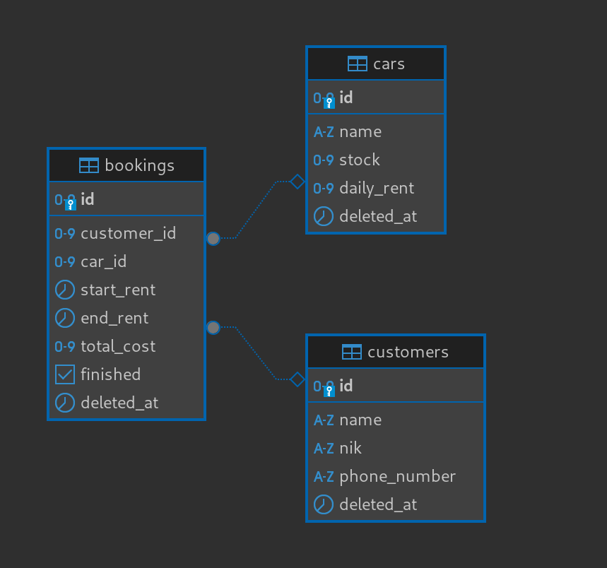
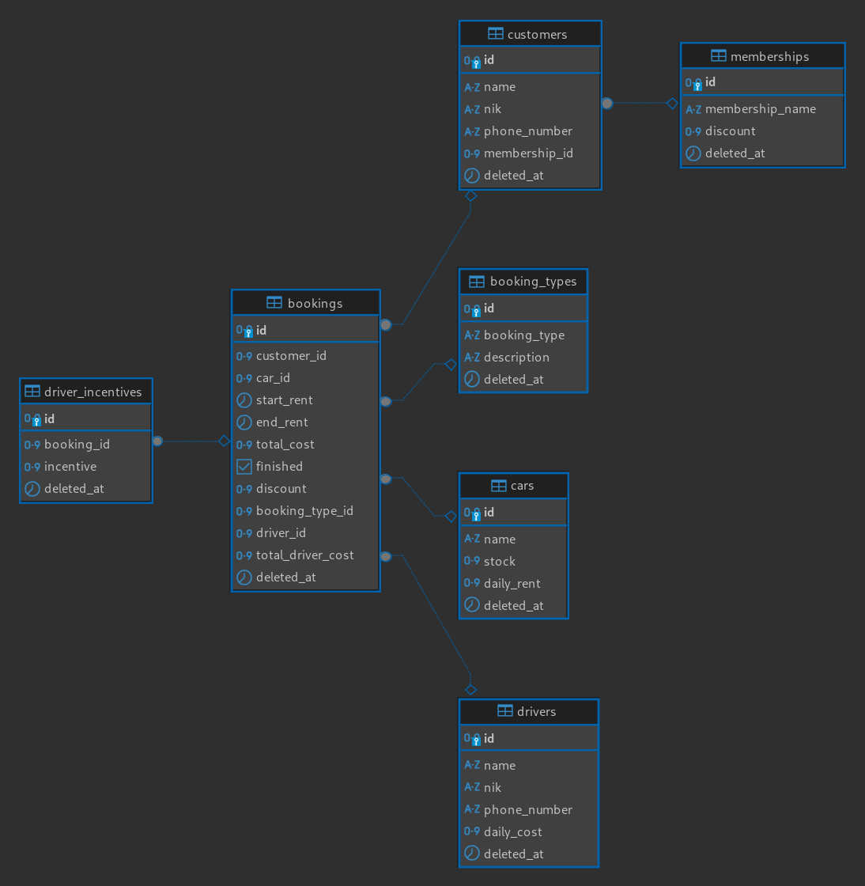

# Car-Rental

This project is a Car Rental API built with Golang and PostgreSQL. The API supports CRUD operations for customers, cars, and bookings, as well as additional features such as membership programs, car rentals with drivers, and driver incentives.

## Project Overview
The Car Rental API is developed in two versions:

- Car Rental - v1: Basic CRUD operations for customers, cars, and bookings.
- Car Rental - v2: Enhancements including membership discounts, rentals with drivers, and incentive calculation for drivers

## Database Design
ERD (Entity Relationship Diagram)

- Car Rental - v1:\

- Car Rental - v2:\

